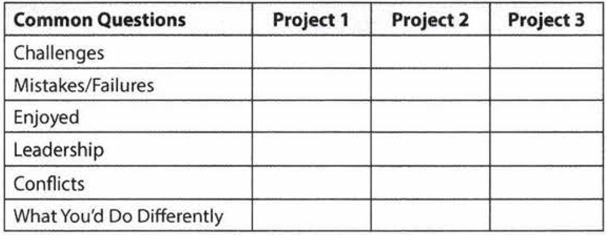
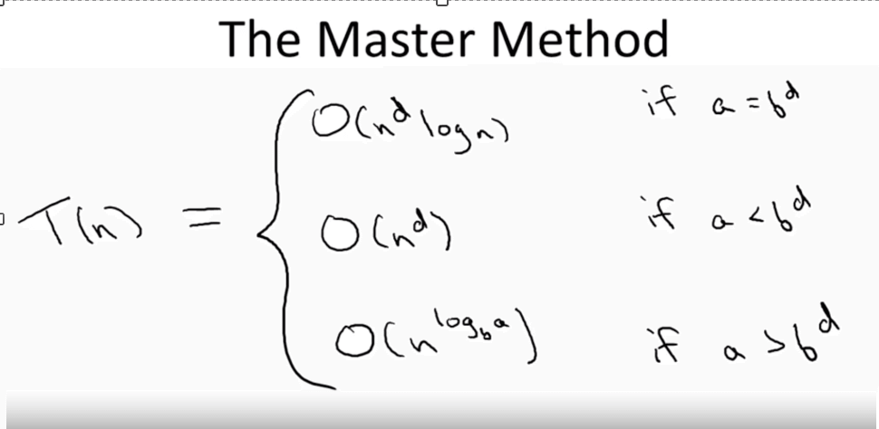
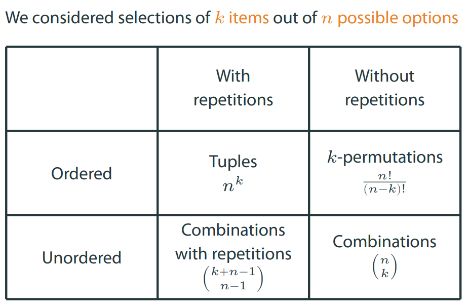

# Technical Interview Cheat Sheet

### Table of Contents

- [Behavioral Questions](#behavioral-questions)
- [Algorithms and Data Structures](#algorithms-and-data-structures)
  - [Big-O](#big-o) 
  - [Divide and Conquer](#divide-and-conquer) 
  - [Graphs and Trees](#graphs-and-trees) 
  - [Dynamic Programming](#dynamic-programming) 
  - [Greedy Algorithms](#greedy-algorithms) 
  - [NP-Completeness](#np-completeness) 
- [Combinatorics](#combinatorics)
- [Operating Systems](#operating-systems)
- [Scalability and Design](#scalability-and-design)
- [Object-Oriented Programming](#object-oriented-programming)
- [Resources](#resources)


## Interview Preparation Grid



**Evaluated skills**:
- Analytical skills
- Coding skills
- Technical knowledge / Computer Science fundamentals
- Experience
- Culture fit / Communication skills


## Behavioral Questions

- Be specific, not arrogant
- Limit Details
- Focus on yourself, not your team
- Give structured answers: **Nugget first**, situation, action, result

#### Tell Me About Yourself

- Current Role (Headline Only)
- College
- Post College & Onwards
- Current Role (Details)
- Outside of Work
- Wrap Up


## Algorithms and Data Structures

### Big-O

- Big O - upper bound
- Big Omega - lower bound
- Big Theta - upper and lower bound - that's what's usually used but called Big O.

#### Amortized time

An ArrayList is implemented with an array. When the array hits capacity, the ArrayList class will 
create a new array with double the capacity and copy all the elements over to the new array.

For most inserts it takes O(1) time. For those inserts where the array is doubling it takes X time. 
`X + X/2 + X/4 + Y/8 + ... + 1` is roughly 2X. 

Therefore X insertions take O(X) time. The amortized time for each insertion is O(1).

### Divide and Conquer
 
Usually recursive  - ex. **Merge Sort**.

**Master Method** (allows to estimate time complexity of a recursive the algorithm):

`T(n) <= a*T(n/b) + O(n^d)`



**QuickSort** - uses partitioning around pivot, works in-place, n*log(n) running time on average.

**Randomized Selection** - allows finding n-th order statistic of an array - uses quick sort algorithm but iterates 
only to 1 subarray, and thus O(n) time (master method case 2).

**Guiding principles for algorithms analysis**:

- Worst case analysis (other are average case, best case)
- Drop constant factors, lower-order terms
- Asymptotic analysis (focus on running time for large input)

### Graphs and Trees

**Minimum cut** - Karger's basic algorithm iteratively contracts randomly chosen edges until only two nodes remain; 
those nodes represent a cut in the original graph. By iterating this basic algorithm a sufficient number of times, 
a minimum cut can be found with high probability.

**BFS (Breadth-first search)** - uses queue. Can be used to find shortest path, connected components.

**DFS (Depth-first search)** - uses stack or recursion. Can be used for topological ordering of DAGs. 
Strongly connected components of directed graphs - 2 passes - first on reverted graph, second on straight graph.

[graph_dfs_bfs.py](code/graph_dfs_bfs.py)

[graph_topological_sort.py](code/graph_topological_sort.py)

**Dijkstra's algorithm** - choose edge with lowest score (sum of current vertex length of shortest path and edge length),
 and add it to the set of explored vertexes. 
- runs in O(m*log(n)) time if heap data structure is used.

[graph_dijkstra.py](code/graph_dijkstra.py)

**Floyd-Warshall algorithms** - finds shortest paths between all pairs of nodes. 
- Uses dynamic programming - matrix Dk stores shortest paths between nodes i and j, allowing to use only intermediary 
nodes with index less than k;
- D0 contains direct paths between nodes i and j. `D(k + 1)\[i,j\] = min(D(k)\[i,j\], D(k)\[i,k\] + D(k)\[k,j\])`.
- runs in O(n^3), where n is number of nodes.


**Heap data structure** - a tree where values in all nodes are larger (smaller for min-heap) that all values in 
respective subnodes.
Time complexity is log(n) for inserting an element, and for extracting min/max element.

**Binary search tree** - all operations are log(n), better than sorted array for inserting/deleting, but worse for 
getting i-th order statistic, min/max, rank, successor/predecessor.
- Find min or max - take `n*log(n)` time. For min, follow left child until there is none. 
- Find successor or predecessor - take `n*log(n)` time. For predecessor, if there is left node, find max of it;
if there is no left node, follow the parent until node is right node of the parent. 
- Insertion and deletion - takes `n*log(n)` time. For insertion just follow search algorithm until you find NULL and 
insert new element there. For deletion, in case a node has only left or right subtree, put it in place of deleted node;
in case both left and right are present, find the predecessor of deleted node, put it in place of deleted node, then 
follow deletion algorithm for predecessor.
- Select and rank (find n-th order statistic) - takes `n*log(n)` time, requires keeping size of subtree i.e. how
many nodes are contained in the tree.


**Red-black tree** - makes binary search tree relatively balances. 
- Invariants: root is always black, no consecutive red nodes, root-to-NULL paths all have same number of block nodes. 
- Invariants are maintained by recoloring nodes and rotations, 
when nodes are inserted or deleted.

**AVL trees** - makes binary search tree relatively balances. Stores in each node the height of the subtrees rooted 
at this node. 
- Invariant: the height of the left subtree and the height of the right subtree differ by no more than one.
- Invariants are maintained via rotations: if left subtree is heavier: LEFT RIGHT SHAPE -> LEFT LEFT SHAPE -> BALANCED.

Binary tree traversals:
- **In-Order** Traversal means to "visit" (often, print) the left branch, then the current node, and finally, the right
branch.
- **Pre-order** traversal visits the current node before its child nodes (hence the name "pre-order").
- **Post-order** traversal visits the current node after its child nodes (hence the name "post-order").

### Dynamic Programming

**Sequence Alignment**:
 
- Given 2 strings A and B find the alignment with lowest penalty. 
- Penalties are given for mismatched characters and for gaps.
- Fill in the matrix `M(i,j)` where i is prefix length of A, j is prefix length of B, `M(i,j)` is best alignment of prefixes.
- `M(0,j) = i*gap_penalty`, analogous for `M(i,0)`. 
`M(i,j) = min(M(i-1,j) + gap_penalty, M(i,j-1) + gap_penalty, M(i-1,j-1) + penalty(i,j))`. 

### Greedy Algorithms

**Minimum Spanning Tree** - a tree with minimum sum of edge costs that spans all vertices.

There are 2 greedy algorithms for finding a minimum spanning tree: 
 
- **Prim's algorithms** - pick random vertex, choose edge with smallest weight that comes from tree to outside. 
Add vertex to tree. Repeat.
- **Kruskal's algorithm** - pick edge with smallest weight, add it to MST if it doesn't create the cycle. Repeat. 
Uses Union-find data structure to check if edge adds a cycle.


**Union-Find** - array where values are references to parent. find() returns the root of tree, union() merges 2 roots.
It provides near-constant-time operations (bounded by the inverse Ackermann function) for both operations.

[union_find.py](code/union_find.py)

**Optimal Caching** - when cache is full, replace furthest-in-the-future element, i.e. the one that will be requested 
latest in the future. 
Replacing least recently used (LRU) is a good approximation to the most optimal algorithms.

**Scheduling Jobs** - pick the job with highest ratio of w/l, where w is job's weight, l is job's length.


### NP-Completeness

- P is the class of decision problems which can be solved in polynomial time by a deterministic Turing machine.
- NP is the class of decision problems which can be solved in polynomial time by a non-deterministic Turing machine. 
Equivalently, it is the class of problems which can be verified in polynomial time by a deterministic Turing machine.
- NP-hard is the class of decision problems to which all problems in NP can be reduced to in polynomial time by a 
deterministic Turing machine.
- NP-complete is the intersection of NP-hard and NP. Equivalently, NP-complete is the class of decision problems in 
NP to which all problems in NP can be reduced to in polynomial time by a deterministic Turing machine.

A reduction from X to Y is simply an algorithm A which solves X by making use of some other algorithm B which solves 
problem Y. This reduction is called a "polynomial time reduction" if all parts of A other than B have a polynomial 
time complexity. As a trivial example, the problem of finding the smallest element in an array is constant-time 
reducible to the sorting problem, since you can sort the array and then return the first element of the sorted array.

Examples of NP-complete problems:

- Knapsack problem - fill the knapsack with items sum of weights of which don't exceed the limit, providing maximum 
sum of values of items. 
- Subset sum problem - given the integers or natural numbers w1, w2, ... wn, does any subset of them sum to precisely W.
- Travelling salesman problem - given a list of cities and the distances between each pair of cities, what is the 
shortest possible route that visits each city and returns to the origin city?
- Graph coloring problem - can be solved using backtracking.
- Boolean satisfiability problem - determining if there exists an interpretation that satisfies a given Boolean formula.

Approaches for solving NP-complete problems:
- Approximation: Instead of searching for an optimal solution, search for a solution that is at most a factor from an 
optimal one.
- Randomization: Use randomness to get a faster average running time, and allow the algorithm to fail with some small 
probability. Note: The Monte Carlo method is not an example of an efficient algorithm in this specific sense, although 
evolutionary approaches like Genetic algorithms may be.
- Restriction: By restricting the structure of the input (e.g., to planar graphs), faster algorithms are usually 
possible.
- Parameterization: Often there are fast algorithms if certain parameters of the input are fixed.
- Heuristic: An algorithm that works "reasonably well" in many cases, but for which there is no proof that it is both 
always fast and always produces a good result. Metaheuristic approaches are often used.

### Checklist for Solving Algorithm and Data Structures Problems

1. Come up with at least 2 examples.
1. Come up with and state the brute force solution.
1. Estimate time and space complexities before writing code - worst case, average case; time, space.
1. For optimization 
    - try different data structures - graph, tree, hashmap, stack, queue.
    - try different algorithm approaches - recursion, divide and conquer, greedy, dynamic programming.
1. Run the code through all examples.
1. Check corner cases.

## Python Cheat Sheet

String functions https://docs.python.org/3/library/stdtypes.html#textseq:

- `string.split(s[, sep[, maxsplit]])`, `string.rsplit(s[, sep[, maxsplit]])` - `maxsplit` means the result will have 
at most `maxsplit+1` elements. 
- `string.find(s, sub[, start[, end]])`, `string.rfind(s, sub[, start[, end]])` - return the lowest index in s where 
the substring sub is found such that sub is wholly contained in `s[start:end]`.
- `string.replace(s, old, new[, maxreplace])`.
- `str.partition(sep)`, `str.rpartition(sep)` - partition the string by separator and return 3-tuple containing the 
part before the separator, the separator itself, and the part after the separator.
- `str.isdigit()`
- `str.isalpha()`
- `str.isalnum()`

Python Cookbook https://www.amazon.com/Python-Cookbook-Third-David-Beazley/dp/1449340377:

- (1.1) `x, y = (4, 5)` - Unpacking a Sequence into Separate Variables

- (1.2) `first, *middle, last = [1, 2, 3, 4]` - Unpacking Elements from Iterables of Arbitrary Length

- (1.3) `deq = collections.deque(maxlen=5)` - Keeping the Last N Items

- (1.4) `heapq.nlargest(3, [1, 8, 2, 23, 7])` - Finding the Largest or Smallest N Items

- (1.5) `heapq.heapify(); heapq.heappush(); heapq.heappop()` - Implementing a Priority Queue

- (1.6) `collections.defaultdict(list)` - Mapping Keys to Multiple Values in a Dictionary

- (1.7) `collections.OrderedDict()` - Keeping Dictionaries in Order

- (1.8) `zip(dict1.values(), dict1.keys())` - Calculating with Dictionaries

- (1.9) `dict1.keys() & dict2.keys()` - Finding Commonalities in Two Dictionaries

- (1.10) `set()` combined with generator function - Removing Duplicates from a Sequence while Maintaining Order

- (1.11) `slice_name = slice(2,5); list1[slice_name]` - Naming a Slice

- (1.12) `collections.Counter()` - Determining the Most Frequently Occurring Items in a Sequence

- (1.13) `sorted(items, key=itemgetter('fname'))` - Sorting a List of Dictionaries by a Common Key

- (1.14) `sorted(items, key=lambda i: i.field1)` - Sorting Objects Without Native Comparison Support

- (1.15) `itertools.groupby()` - Grouping Records Together Based on a Field

- (1.16) `[item for item in [-1, 2, 3] if n > 0]` - Filtering Sequence Elements

- (1.17) `{ key:value for key,value in dict1.items() if key in set1 }` - Extracting a Subset of a Dictionary

- (1.18) `collections.namedtuple('MyEntity', ['field1', 'field2'])` - Mapping Names to Sequence Elements

- (1.20) `collections.ChainMap` or `dict1.update(dict2)` - Combining Multiple Mappings into a Single Mapping

Google's Python style guide: https://google.github.io/styleguide/pyguide.html.

## Combinatorics

https://www.coursera.org/learn/combinatorics

- Tuples: `n^k` - strings of length k from alphabet of size n, where characters can be repeated. 
Distribute n assignments among k people: `k ^ n` (look from a different point of view).  
- Permutations: `n!/(n - k)!` - strings of length k from alphabet of size n, where characters can not be repeated.
- Combinations: `(n choose k)` = `n! / ((n - k)! * k!)` - form teams of size k from n people.
- Combinations with repetitions: `(k + n - 1) choose (n - 1)` - make a salad consisting of k units, which can be chosen out of
n types of ingredients, ingredients of each type are unlimited (we don't have to use all ingredients), order 
doesn't matter. Distribute n candies among k children, every child can receive from 0 to n candies: 
`(k + n - 1) choose (k - 1)` (look from a different point of view).

Binomial Theorem: `(x + y) ^ n = sum((n choose k) * a^(n-k) * b^k), for all 0 <= k <= n`.

 


## Operating Systems

http://pages.cs.wisc.edu/~remzi/OSTEP/

Tracing system calls on MacOS:
 
For a given pid:

```bash
sudo dtruss -p <pid>
```

Start a process with tracing:

```bash
pip install ethereum-etl
# trace open file system calls
sudo dtruss ethereumetl export_all --start 2019-01-01 --end 2019-01-02 -w 1 2>&1 | grep open
```

List files for process starting with `pname`:

```bash
lsof -c pname
```

## Scalability and Design

- List all assumptions - needed to scope the project
- Draft high-level solution
- List limitations
- List Hard problems - what will take most effort


## Object-Oriented Programming

- Abstraction - represent real-world entities with their abstraction i.e. classes in code.
- Encapsulation - hide the implementation details and expose the interface.
- Inheritance - build class hierarchy to represent subset/superset relationships in real world.  
- Polymorphism - write your code with interfaces, the implementation will be chosen at runtime.


## Resources

- Cracking The Coding Interview: https://www.amazon.com/Cracking-Coding-Interview-Programming-Questions/dp/0984782850
- Operating Systems: http://pages.cs.wisc.edu/~remzi/OSTEP/
- Algorithms Specialization on Coursera: https://www.coursera.org/specializations/algorithms
- Socket Programming in Python: https://realpython.com/python-sockets/

