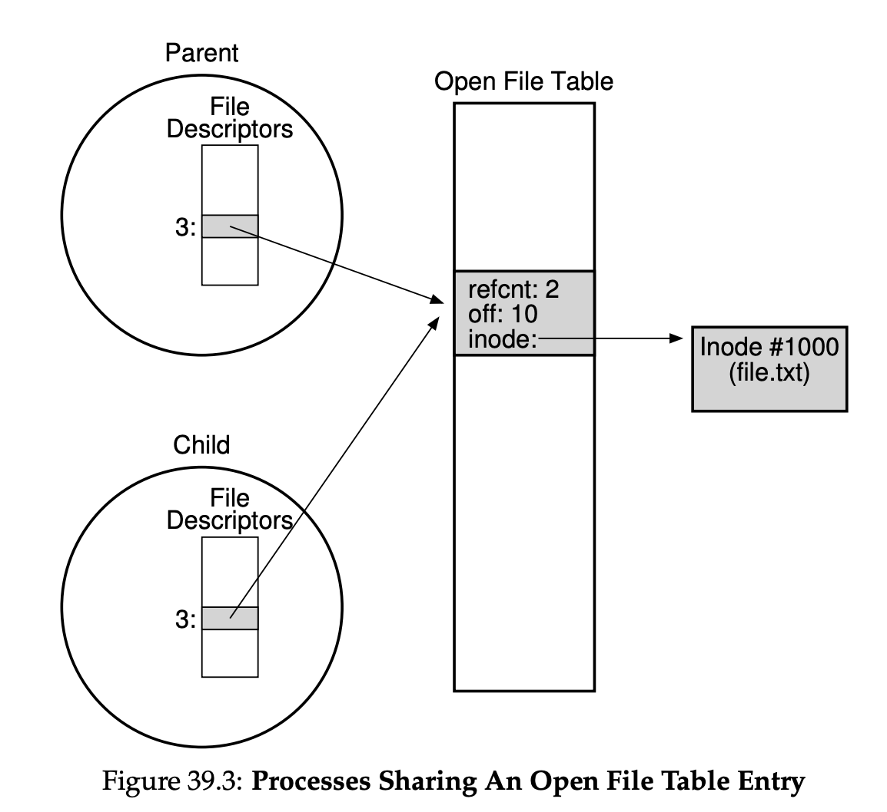

# Technical Interview Cheat Sheet

### Table of Contents

- [Behavioral Questions](#behavioral-questions)
- [Algorithms and Data Structures](#algorithms-and-data-structures)
  - [Big-O](#big-o) 
  - [Divide and Conquer](#divide-and-conquer) 
  - [Graphs and Trees](#graphs-and-trees) 
  - [Dynamic Programming](#dynamic-programming) 
  - [Greedy Algorithms](#greedy-algorithms) 
  - [NP-Completeness](#np-completeness) 
- [Combinatorics](#combinatorics)
- [Operating Systems](#operating-systems)
- [Scalability and Design](#scalability-and-design)
- [Object-Oriented Programming](#object-oriented-programming)
- [Resources](#resources)


## Interview Preparation Grid


**Evaluated skills**:
- Analytical skills
- Coding skills
- Technical knowledge / Computer Science fundamentals
- Experience
- Culture fit / Communication skills


## Behavioral Questions

- Be specific, not arrogant
- Limit Details
- Focus on yourself, not your team
- Give structured answers: **Nugget first**, situation, action, result

#### Tell Me About Yourself

- Current Role (Headline Only)
- College
- Post College & Onwards
- Current Role (Details)
- Outside of Work
- Wrap Up


## Algorithms and Data Structures

### Big-O

- Big O - upper bound
- Big Omega - lower bound
- Big Theta - upper and lower bound - that's what's usually used but called Big O.

#### Amortized time

An ArrayList is implemented with an array. When the array hits capacity, the ArrayList class will 
create a new array with double the capacity and copy all the elements over to the new array.

For most inserts it takes O(1) time. For those inserts where the array is doubling it takes X time. 
`X + X/2 + X/4 + Y/8 + ... + 1` is roughly 2X. 

Therefore X insertions take O(X) time. The amortized time for each insertion is O(1).

### Divide and Conquer
 
Usually recursive  - ex. **Merge Sort**.

**Master Method** (allows to estimate time complexity of a recursive algorithm):

`T(n) <= a*T(n/b) + O(n^d)`


**QuickSort** - uses partitioning around pivot, works in-place, n*log(n) running time on average.

**Randomized Selection** - allows finding n-th order statistic of an array - uses quick sort algorithm but iterates 
only to 1 subarray, and thus O(n) time (master method case 2).

**Guiding principles for algorithms analysis**:

- Worst case analysis (others are average case, best case)
- Drop constant factors, lower-order terms
- Asymptotic analysis (focus on running time for large input)

### Graphs and Trees

**Minimum cut** - Karger's basic algorithm iteratively contracts randomly chosen edges until only two nodes remain; 
those nodes represent a cut in the original graph. By iterating this basic algorithm a sufficient number of times, 
a minimum cut can be found with high probability.

**BFS (Breadth-first search)** - uses queue. Can be used to find shortest path, connected components.

**DFS (Depth-first search)** - uses stack or recursion. Can be used for topological ordering of DAGs. 
Strongly connected components of directed graphs - 2 passes - first on reverted graph, second on straight graph.

[graph_dfs_bfs.py](code/graph_dfs_bfs.py)

[graph_topological_sort.py](code/graph_topological_sort.py)

**Dijkstra's algorithm** - choose edge with lowest score (sum of current vertex length of shortest path and edge length),
 and add it to the set of explored vertexes. 
- runs in O(m*log(n)) time if heap data structure is used.

[graph_dijkstra.py](code/graph_dijkstra.py)

**Floyd-Warshall algorithms** - finds shortest paths between all pairs of nodes. 
- Uses dynamic programming - matrix Dk stores shortest paths between nodes i and j, allowing to use only intermediary 
nodes with index less than k;
- D0 contains direct paths between nodes i and j. `D(k + 1)\[i,j\] = min(D(k)\[i,j\], D(k)\[i,k\] + D(k)\[k,j\])`.
- runs in O(n^3), where n is number of nodes.


**Heap data structure** - a tree where values in all nodes are larger (smaller for min-heap) that all values in 
respective subnodes.
Time complexity is log(n) for inserting an element, and for extracting min/max element.

**Binary search tree** - all operations are log(n), better than sorted array for inserting/deleting, but worse for 
getting i-th order statistic, min/max, rank, successor/predecessor.
- Find min or max - take `log(n)` time. For min, follow left child until there is none. 
- Find successor or predecessor - take `log(n)` time. For predecessor, if there is left node, find max of it;
if there is no left node, follow the parent until node is right node of the parent. 
- Insertion and deletion - takes `log(n)` time. For insertion just follow search algorithm until you find NULL and 
insert new element there. For deletion, in case a node has only left or right subtree, put it in place of deleted node;
in case both left and right are present, find the predecessor of deleted node, put it in place of deleted node, then 
follow deletion algorithm for predecessor.
- Select and rank (find n-th order statistic) - takes `log(n)` time, requires keeping size of subtree i.e. how
many nodes are contained in the tree.


**Red-black tree** - makes binary search tree relatively balanced. 
- Invariants: root is always black, no consecutive red nodes, root-to-NULL paths all have same number of block nodes. 
- Invariants are maintained by recoloring nodes and rotations, 
when nodes are inserted or deleted.

**AVL trees** - makes binary search tree relatively balanced. Stores in each node the height of the subtrees rooted 
at this node. 
- Invariant: the height of the left subtree and the height of the right subtree differ by no more than one.
- Invariants are maintained via rotations: if left subtree is heavier: LEFT RIGHT SHAPE -> LEFT LEFT SHAPE -> BALANCED.

Binary tree traversals:
- **In-Order** Traversal means to "visit" (often, print) the left branch, then the current node, and finally, the right
branch.
- **Pre-order** traversal visits the current node before its child nodes (hence the name "pre-order").
- **Post-order** traversal visits the current node after its child nodes (hence the name "post-order").

[trie.py](code/trie.py)

[radix_sort.py](code/radix_sort.py)

### Dynamic Programming

**Sequence Alignment**:
 
- Given 2 strings A and B find the alignment with lowest penalty. 
- Penalties are given for mismatched characters and for gaps.
- Fill in the matrix `M(i,j)` where i is prefix length of A, j is prefix length of B, `M(i,j)` is best alignment of prefixes.
- `M(0,j) = i*gap_penalty`, analogous for `M(i,0)`. 
`M(i,j) = min(M(i-1,j) + gap_penalty, M(i,j-1) + gap_penalty, M(i-1,j-1) + penalty(i,j))`. 

### Greedy Algorithms

**Minimum Spanning Tree** - a tree with minimum sum of edge costs that spans all vertices.

There are 2 greedy algorithms for finding a minimum spanning tree: 
 
- **Prim's algorithms** - pick random vertex, choose edge with smallest weight that comes from tree to outside. 
Add vertex to tree. Repeat.
- **Kruskal's algorithm** - pick edge with smallest weight, add it to MST if it doesn't create the cycle. Repeat. 
Uses Union-find data structure to check if edge adds a cycle.


**Union-Find** - array where values are references to parent. find() returns the root of tree, union() merges 2 roots.
It provides near-constant-time operations (bounded by the inverse Ackermann function) for both operations.

[union_find.py](code/union_find.py)

**Optimal Caching** - when cache is full, replace furthest-in-the-future element, i.e. the one that will be requested 
latest in the future. 
Replacing least recently used (LRU) is a good approximation to the most optimal algorithms.

**Scheduling Jobs** - pick the job with highest ratio of w/l, where w is job's weight, l is job's length.


### NP-Completeness

- P is the class of decision problems which can be solved in polynomial time by a deterministic Turing machine.
- NP is the class of decision problems which can be solved in polynomial time by a non-deterministic Turing machine. 
Equivalently, it is the class of problems which can be verified in polynomial time by a deterministic Turing machine.
- NP-hard is the class of decision problems to which all problems in NP can be reduced to in polynomial time by a 
deterministic Turing machine.
- NP-complete is the intersection of NP-hard and NP. Equivalently, NP-complete is the class of decision problems in 
NP to which all problems in NP can be reduced to in polynomial time by a deterministic Turing machine.

A reduction from X to Y is simply an algorithm A which solves X by making use of some other algorithm B which solves 
problem Y. This reduction is called a "polynomial time reduction" if all parts of A other than B have a polynomial 
time complexity. As a trivial example, the problem of finding the smallest element in an array is constant-time 
reducible to the sorting problem, since you can sort the array and then return the first element of the sorted array.

Examples of NP-complete problems:

- Knapsack problem - fill the knapsack with items sum of weights of which don't exceed the limit, providing maximum 
sum of values of items. 
- Subset sum problem - given the integers or natural numbers w1, w2, ... wn, does any subset of them sum to precisely W.
- Travelling salesman problem - given a list of cities and the distances between each pair of cities, what is the 
shortest possible route that visits each city and returns to the origin city?
- Graph coloring problem - can be solved using backtracking. In social networks, creating groups of people none of whom
are friends - mixer party.
- Boolean satisfiability problem (SAT) - determining if there exists an interpretation that satisfies a given Boolean formula.

To show that some problem A is NP-complete, try reducing some other NP-complete problem to A.

Approaches for solving NP-complete problems:
- Approximation: Instead of searching for an optimal solution, search for a solution that is at most a factor from an 
optimal one.
- Randomization: Use randomness to get a faster average running time, and allow the algorithm to fail with some small 
probability. Note: The Monte Carlo method is not an example of an efficient algorithm in this specific sense, although 
evolutionary approaches like Genetic algorithms may be.
- Restriction: By restricting the structure of the input (e.g., to planar graphs), faster algorithms are usually 
possible.
- Parameterization: Often there are fast algorithms if certain parameters of the input are fixed.
- Heuristic: An algorithm that works "reasonably well" in many cases, but for which there is no proof that it is both 
always fast and always produces a good result. Metaheuristic approaches are often used.

### Checklist for Solving Algorithm and Data Structures Problems

1. Come up with at least 2 examples.
1. Come up with and state the brute force solution.
1. Estimate time and space complexities before writing code - worst case, average case; time, space.
1. For optimization 
    - try different data structures - graph, tree, hashmap, stack, queue.
    - try different algorithm approaches - recursion, divide and conquer, greedy, dynamic programming.
1. Run the code through all examples.
1. Check corner cases.

## Python Cheat Sheet

String functions https://docs.python.org/3/library/stdtypes.html#textseq:

- `string.split(s[, sep[, maxsplit]])`, `string.rsplit(s[, sep[, maxsplit]])` - `maxsplit` means the result will have 
at most `maxsplit+1` elements. 
- `string.find(s, sub[, start[, end]])`, `string.rfind(s, sub[, start[, end]])` - return the lowest index in s where 
the substring sub is found such that sub is wholly contained in `s[start:end]`.
- `string.replace(s, old, new[, maxreplace])`.
- `str.partition(sep)`, `str.rpartition(sep)` - partition the string by separator and return 3-tuple containing the 
part before the separator, the separator itself, and the part after the separator.
- `str.isdigit()`
- `str.isalpha()`
- `str.isalnum()`

Python Cookbook https://www.amazon.com/Python-Cookbook-Third-David-Beazley/dp/1449340377:

- (1.1) `x, y = (4, 5)` - Unpacking a Sequence into Separate Variables

- (1.2) `first, *middle, last = [1, 2, 3, 4]` - Unpacking Elements from Iterables of Arbitrary Length

- (1.3) `deq = collections.deque(maxlen=5)` - Keeping the Last N Items

- (1.4) `heapq.nlargest(3, [1, 8, 2, 23, 7])` - Finding the Largest or Smallest N Items

- (1.5) `heapq.heapify(); heapq.heappush(); heapq.heappop()` - Implementing a Priority Queue

- (1.6) `collections.defaultdict(list)` - Mapping Keys to Multiple Values in a Dictionary

- (1.7) `collections.OrderedDict()` - Keeping Dictionaries in Order

- (1.8) `zip(dict1.values(), dict1.keys())` - Calculating with Dictionaries

- (1.9) `dict1.keys() & dict2.keys()` - Finding Commonalities in Two Dictionaries

- (1.10) `set()` combined with generator function - Removing Duplicates from a Sequence while Maintaining Order

- (1.11) `slice_name = slice(2,5); list1[slice_name]` - Naming a Slice

- (1.12) `collections.Counter()` - Determining the Most Frequently Occurring Items in a Sequence

- (1.13) `sorted(items, key=itemgetter('fname'))` - Sorting a List of Dictionaries by a Common Key

- (1.14) `sorted(items, key=lambda i: i.field1)` - Sorting Objects Without Native Comparison Support

- (1.15) `itertools.groupby()` - Grouping Records Together Based on a Field

- (1.16) `[item for item in [-1, 2, 3] if n > 0]` - Filtering Sequence Elements

- (1.17) `{ key:value for key,value in dict1.items() if key in set1 }` - Extracting a Subset of a Dictionary

- (1.18) `collections.namedtuple('MyEntity', ['field1', 'field2'])` - Mapping Names to Sequence Elements

- (1.20) `collections.ChainMap` or `dict1.update(dict2)` - Combining Multiple Mappings into a Single Mapping

Google's Python style guide: https://google.github.io/styleguide/pyguide.html.

## Combinatorics

https://www.coursera.org/learn/combinatorics

- Tuples: `n^k` - strings of length k from alphabet of size n, where characters can be repeated. 
Distribute n assignments among k people: `k ^ n` (look from a different point of view).  
- Permutations: `n!/(n - k)!` - strings of length k from alphabet of size n, where characters can not be repeated.
- Combinations: `(n choose k)` = `n! / ((n - k)! * k!)` - form teams of size k from n people.
- Combinations with repetitions: `(k + n - 1) choose (n - 1)` - make a salad consisting of k units, which can be chosen out of
n types of ingredients, ingredients of each type are unlimited (we don't have to use all ingredients), order 
doesn't matter. Distribute n candies among k children, every child can receive from 0 to n candies: 
`(k + n - 1) choose (k - 1)` (look from a different point of view).

Binomial Theorem: `(x + y) ^ n = sum((n choose k) * a^(n-k) * b^k), for all 0 <= k <= n`.

 


## Operating Systems

http://pages.cs.wisc.edu/~remzi/OSTEP/

### Virtualization

#### CPU Virtualization (time sharing)

**Basics**:

- The **process** is the major OS abstraction of **a running program**. At any point in time, the process can be described by 
its state: the contents of memory in its **address space**, the contents of **CPU registers** (including the **program counter** 
and **stack pointer**, among others), and information about I/O (such as **open files** which can be read or
written).
- The process **API** consists of calls programs can make related to processes. Typically, this includes **creation**, 
**destruction**, and other useful calls.
- Processes exist in one of many different process **states**, including **ready**, **running**, and **blocked**. 
Different events (e.g., getting scheduled or descheduled, or waiting for an I/O to complete) transition a process 
from one of these states to the other.
- A process list contains information about all processes in the system. Each entry is found in what is sometimes 
called a **process control block (PCB)**, which is really just a structure that contains information about a 
specific process.
    - State (ready, running, blocked)
    - PC (program counter).
    - Stack pointer.
    - Frame pointer.
    - Register context.
    - Open files.
    
 

**Process API**:

- Each process has a a process ID (PID).
- The **`fork()`** system call is used in UNIX systems to create a new process. The creator is called the parent; 
the newly created process is called the child. As sometimes occurs in real life, the child process is a nearly 
identical copy of the parent.
- The **`wait()`** system call allows a parent to wait for its child to complete execution.
- The **`exec()`** family of system calls allows a child to break free from its similarity to its parent and execute an 
entirely new program.
- A UNIX shell commonly uses `fork()`, `wait()`, and `exec()` to launch user commands; **the separation of fork 
and exec enables features like input/output redirection, pipes, and other cool features**, all without changing anything 
about the programs being run.
- Process control is available in the form of **signals**, which can cause jobs to stop, continue, or even terminate.
- Which processes can be controlled by a particular person is encapsulated in the notion of a **user**; 
the operating system allows multiple users onto the system, and ensures users can only control their own processes.
- A superuser can control all processes (and indeed do many other things); this role should be assumed infrequently 
and with caution for security reasons.

**Limited Direct Execution**:

- The CPU should support at least two modes of execution: a restricted **user mode** and 
a privileged (non-restricted) **kernel mode**.
- Typical user applications run in user mode, and use a system call to **trap** into the kernel to request operating 
system services.
- The trap instruction saves register state carefully, changes the hardware status to kernel mode, and jumps into 
the OS to a pre-specified destination: the **trap table**.
- When the OS finishes servicing a system call, it returns to the user program via another special **return-from-trap** 
instruction, which reduces privilege and returns control to the instruction after the trap that jumped into the OS.
- The trap tables must be set up by the OS at boot time, and make sure that they cannot be readily modified by user 
programs. All of this is part of the **limited direct execution** protocol which runs programs efficiently but without 
loss of OS control.
- Once a program is running, the OS must use hardware mechanisms to ensure the user program does not run forever, 
namely the **timer interrupt**. This approach is a non-cooperative approach to CPU scheduling.
- Sometimes the OS, during a timer interrupt or system call, might wish to switch from running the current process 
to a different one, a low-level technique known as a **context switch**.


Each process has a **kernel stack** (or more generally, each thread has its own stack) - 
https://www.cs.umb.edu/~eoneil/cs444_f06/class10.html

Just like there has to be a separate place for each process to hold its set of saved registers 
(in its process table entry), each process also needs its own kernel stack, to work as its execution stack when it is 
executing in the kernel.

For example, if a process is doing a read syscall, it is executing the kernel code for read, and needs a stack to do 
this. It could block on user input, and give up the CPU, but that whole execution environment held on the 
stack (and in the saved CPU state in the process table entry) has to be saved for its later use. Another process 
could run meanwhile and do its own syscall, and then it needs its own kernel stack, separate from that blocked 
reader's stack, to support its own kernel execution.

Since threads can also do system calls, each needs a kernel stack as well.

In Linux, the process/thread table entry and kernel stack are bundled up in one block of memory for each thread. 
Other OS's organize the memory differently, but still have both of these for each process/thread.

Sometimes the kernel stack is completely empty, notably when the process is executing user code.  
Then when it does a system call, the kernel stack starts growing, and later shrinking back to nothing at the 
system call return.

 

**CPU Scheduling**:

Shortest Job First (SJF) - run shorter jobs before longer ones. Good for **turnaround time** (time since arrival to completion),
bad for **responsiveness**. Preemptive Shortest Job First (PSJF) - same as SJF but jobs that arrive later can preempt 
already running jobs.

Round Robin - run jobs one by one in a circle. Good for responsiveness, bad for turnaround.

**The Multi-Level Feedback Queue**:

It has multiple levels of queues, and uses feedback to determine the priority of a given job. Balance of responsiveness
and turnaround.

- Rule 1: If Priority(A) > Priority(B), A runs (B doesn’t).
- Rule 2: If Priority(A) = Priority(B), A & B run in round-robin fashion using the time slice (quantum length) 
of the given queue.
- Rule 3: When a job enters the system, it is placed at the highest priority (the topmost queue).
- Rule 4: Once a job uses up its time allotment at a given level (regardless of how many times it has given up the CPU), 
its priority is reduced (i.e., it moves down one queue).
- Rule 5: After some time period S, move all the jobs in the system to the topmost queue.

#### Memory Virtualization (space sharing)

Every process has an illusion of private memory. The OS builds this abstraction of a private, potentially large
address space for multiple running processes (all sharing memory) on  top of a single, physical memory.

 

- `pointer = malloc(size)` - allocate memory.
- `free(pointer)` - free memory.
- `sizeof(pointer)` - size of allocated slot.

They are not system calls, but instead library functions.

System calls:

- `brk`, which is used to change the location of the program's break: the location of the end of the heap. Automatically 
called by `malloc()` and `free()` if necessary.

**Address Translation**

The hardware provides the **base and bounds** registers; each CPU thus has an additional pair of registers, part of the 
**memory management unit (MMU)** of the CPU. When a user program is running, the hardware will translate each address, 
by adding the base value to the virtual address generated by the user program. The hardware must also be able to check 
whether the address is valid, which is accomplished by using the bounds register and some circuitry within the CPU. 

Base and bounds registers can only be modified in **kernel mode** by the OS during context switches.

**Segmentation** - there is base and bounds registers for each segment of memory: code, heap and stack.

**Free Space Management**

When `malloc()` and `free()` are called, the library updates the data structure called **free list**, where
free chunks of memory are recorded. Most allocators store a little bit of extra information in a **header** block which 
is kept in memory, usually **just before the handed-out chunk** of memory.

 

Strategies for finding free memory:

The **best fit** strategy is quite simple: first, search through the free list and
find chunks of free memory that are as big or bigger than the requested
size. Then, return the one that is the smallest in that group of candidates;
this is the so called best-fit chunk (it could be called smallest fit too).

**Worst fit** tries to thus leave big chunks free instead of lots of small chunks that can arise from a best-fit 
approach.

The **first fit** method simply finds the first block that is big enough and returns the requested amount to the user.

**Paging**

Physical memory is divided into physical frames: fixed-size chunks of memory. OS with the help of hardware maintains
a **page translation table** in memory that maps **virtual page numbers (VPN)** to **physical frame numbers (PFN)**.


 

Paging has many advantages over previous approaches (such as segmentation). First, it does not lead to external
fragmentation, as paging (by design) divides memory into fixed-sized units. Second, it is quite flexible, enabling the 
sparse use of virtual address spaces.

**Translation Look-aside Buffers (TLBs)**

Hardware provides a small, dedicated on-chip TLB as an **address-translation cache**, most memory references will 
hopefully be handled without having to access the page table in main memory. Thus, in the common case, the performance 
of the program will be almost as if memory isn't being virtualized at all, an excellent achievement for an operating 
system, and certainly essential to the use of paging in modern systems.

If the number of pages a program accesses in a short period of time exceeds the number of pages that fit into the TLB, 
the program will generate a large number of TLB misses, and thus run quite a bit more slowly. We refer to this 
phenomenon as **exceeding the TLB coverage**, and it can be quite a problem for certain programs. Some OSes support
larger page sizes which increases effective coverage of the TLB. It's often utilized by DBMS.

Entry in TLB:

VPN | PFN | valid bit | protection bits | ASID (address space identifier, similar to PID but fewer bits) |
----|-----|-----------|-----------------|----------------------------------------------------------------|
10  |  100| 1         | rwx             | 1                                                              |

**Page Table Optimizations**

 

Linear is faster but uses more memory. Multi-level uses less memory but slower. 

The trade-offs multi-level tables present are in time and space — the bigger the table, the faster a TLB miss can be 
serviced, as well as the converse — and thus the right choice of structure depends strongly on the constraints of 
the given environment.

**Swapping**

Processes can access more memory than is physically present within a system. To do so requires more complexity in 
page-table structures, as a present bit (of some kind) must be included to tell us whether the page is present in 
memory or not. When not, the operating system **page-fault** handler runs to service the page fault, and thus arranges 
for the transfer of the desired page from disk to memory, perhaps first replacing some pages in memory to make
room for those soon to be swapped in.

These actions all take place transparently to the process. As far as the process is concerned, it is just accessing 
its own private, contiguous virtual memory. Behind the scenes, pages are placed in arbitrary (non-contiguous) locations 
in physical memory, and sometimes they are not even present in memory, requiring a fetch from disk. While we hope 
that in the common case a memory access is fast, in some cases it will take multiple disk operations to service it; 
something as simple as performing a single instruction can, in the worst case, take many milliseconds to complete.

To keep a small amount of memory free, most operating systems thus have some kind of **high watermark (HW)** and 
**low watermark (LW)** to help decide when to start evicting pages from memory. The background thread, sometimes 
called the **swap daemon** or page daemon, then goes to sleep, happy that it has freed some memory for running
processes and the OS to use.

**Linux Address Space**

 

### Concurrency

- A **critical section** is a piece of code that accesses a shared resource,
usually a variable or data structure.
- A **race condition** arises if multiple threads of
execution enter the critical section at roughly the same time; both
attempt to update the shared data structure, leading to a surprising
(and perhaps undesirable) outcome.
- An **indeterminate** program consists of one or more race conditions;
the output of the program varies from run to run, depending on
which threads ran when. The outcome is thus not **deterministic**,
something we usually expect from computer systems.
- To avoid these problems, threads should use some kind of **mutual
exclusion** primitives; doing so guarantees that only a single thread
ever enters a critical section, thus avoiding races, and resulting in
deterministic program outputs.

 

**Locks**

Hardware provides primitives for implementing locks by OS:
- `old = testAndSet(var, old, new)` - updates the variable and returns the old value atomically.
- `compareAndSwap()`
- `fetchAndAdd()`

They can be used to implement a simple spin-lock - the one that continuously tests the lock. A better implementation is
to use a queue with waiting thread IDs. A guard is used a a spin lock, then the lock is acquired if it's available,
otherwise thread is *parked* to the queue, when unlocking another thread is *unparked* from the queue.

**Condition Variables**

To wait for a condition to become true, a thread can make use of what is known as a **condition variable**. 
A condition variable is an explicit queue that threads can put themselves on when some state of execution 
(i.e., some condition) is not as desired (by **waiting** on the condition); some other thread, when it changes said 
state, can then wake one (or more) of those waiting threads and thus allow them to continue 
(by **signaling** on the condition).

Condition Variables can be used to solve Producer/Consumer problem. Producer sends a signal when adding item to queue,
consumer sends signal when item removed from queue.

**Semaphores**

```
int sem_wait(sem_t *s) {
  decrement the value of semaphore s by one
  wait if value of semaphore s is negative
}  

int sem_post(sem_t *s) {
  increment the value of semaphore s by one
  if there are one or more threads waiting, wake one
}  
```

- A semaphore initialized with value 1 behaves like a **lock**.
- A semaphore initialized with value 0 behaves like a **condition variable**.

Semaphores can be used to solve thread throttling problem: https://github.com/blockchain-etl/blockchain-etl-common/blob/master/blockchainetl_common/executors/bounded_executor.py

**Event-Based Concurrency**

Pseudocode for an event loop:

```
while (1) {
    events = getEvents();
    for (e in events)
    processEvent(e);
}
```  

OS provides system calls `select()` or `poll()` to get the list of ready I/O descriptors:

```
int select(int nfds,
    fd_set *restrict readfds,
    fd_set *restrict writefds,
    fd_set *restrict errorfds,
    struct timeval *restrict timeout);
```

`select()` examines the I/O descriptor sets whose addresses are passed in readfds, writefds, and errorfds to see if some 
of their descriptors are ready for reading, are ready for writing, or have an exceptional condition pending, 
respectively. The first nfds descriptors are checked in each set, i.e., the descriptors from 0 through nfds-1 in 
the descriptor sets are examined. On return, select() replaces the given descriptor sets with subsets consisting of 
those descriptors that are ready for the requested operation. `select()` returns the total number of ready descriptors 
in all the sets.

`select()` must be used in combination with asynchronous I/O system calls. An example system call for async read:

`int aio_read(struct aiocb *aiocbp);`

### Persistence

inode - a data structure in a file system that describes a file-system object, e.g. a file or a directory. 

Below is an example of information stored in an inode:

```
struct stat {
    dev_t st_dev; // ID of device containing file
    ino_t st_ino; // inode number
    mode_t st_mode; // protection
    nlink_t st_nlink; // number of hard links
    uid_t st_uid; // user ID of owner
    gid_t st_gid; // group ID of owner
    dev_t st_rdev; // device ID (if special file)
    off_t st_size; // total size, in bytes
    blksize_t st_blksize; // blocksize for filesystem I/O
    blkcnt_t st_blocks; // number of blocks allocated
    time_t st_atime; // time of last access
    time_t st_mtime; // time of last modification
    time_t st_ctime; // time of last status change
};  
``` 

`ln file file2` - creates a hard link by incrementing hard link counter in the inode.

`ln -s file file2` - creates a soft link by creating another inode with type soft link.

 

 

Read timeline for `/foo/bar`

 

### Network

[sockets_echo_server.py](code/sockets_echo_server.py)

[sockets_echo_client.py](code/sockets_echo_client.py)

### Tracing System Calls

Tracing system calls on MacOS:
 
For a given pid:

```bash
sudo dtruss -p <pid>
```

Start a process with tracing:

```bash
pip install ethereum-etl
# trace open file system calls
sudo dtruss ethereumetl export_all --start 2019-01-01 --end 2019-01-02 -w 1 2>&1 | grep open
```

List open files for process starting with `pname`:

```bash
lsof -c pname
```

## Scalability and Design

- List all assumptions - needed to scope the project
- Draft high-level solution
- List limitations
- List Hard problems - what will take most effort

https://www.quora.com/Is-there-any-book-to-prepare-for-System-Design-and-Architecture-interview-questions

You should be familiar with the speed of everything your computer can do, including the relative performance of RAM, disk, SSD and your network.

https://github.com/donnemartin/system-design-primer

## Object-Oriented Programming

- Abstraction - represent real-world entities with their abstraction i.e. classes in code.
- Encapsulation - hide the implementation details and expose the interface.
- Inheritance - build class hierarchy to represent subset/superset relationships in real world.  
- Polymorphism - write your code with interfaces, the implementation will be chosen at runtime.


## Resources

- Cracking The Coding Interview: https://www.amazon.com/Cracking-Coding-Interview-Programming-Questions/dp/0984782850
- Operating Systems: http://pages.cs.wisc.edu/~remzi/OSTEP/
- Algorithms Specialization on Coursera: https://www.coursera.org/specializations/algorithms
- Socket Programming in Python: https://realpython.com/python-sockets/

